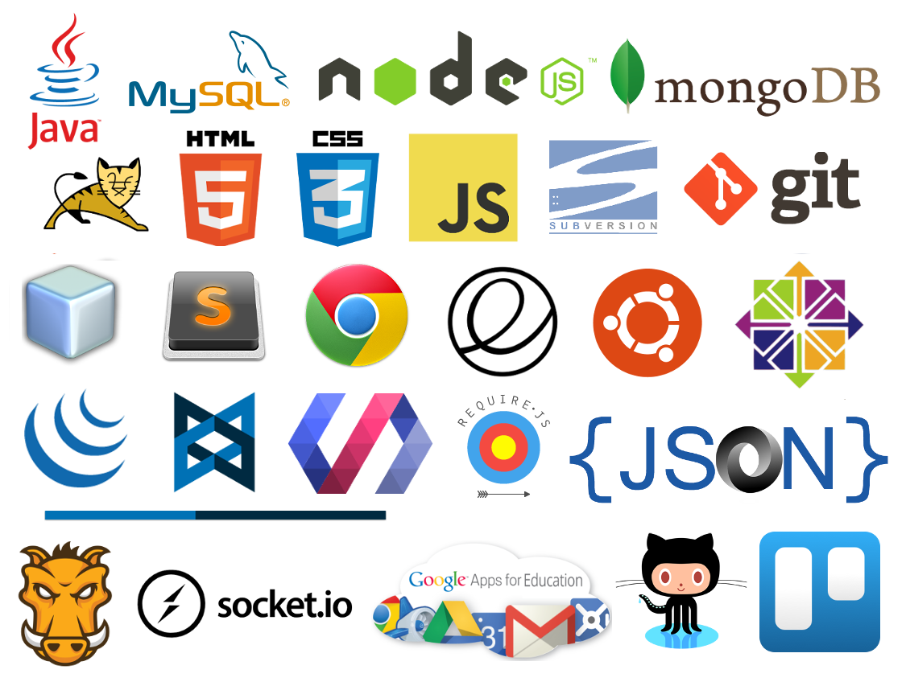

# Calumet Aprender

Recursos para aprender y ejemplos de aplicaciones web de las tecnologías de los cursos de desarrollo web ofrecidos por el [Grupo Calumet](http://cormoran.uis.edu.co/calumet).

Se asumen conocimientos en programación orientada a objetos, experiencia básica con el lenguaje de programación Java y nivel intermedio de lectura y comprensión en inglés.

Si es un instructor, puede usar algunas de las directivas en la [guía para instructores](instructors.md). 

## Herramientas

Conocer qué herramientas libres se pueden utilizar para desarrollar aplicaciones web. Desde sistemas operativos hasta editores de código.

Algunas herramientas (y servicios) libres/gratuitas recomendadas:

- Distribución de GNU/Linux: [Ubuntu Desktop OS](http://ubuntu.com)
- Entorno integrado de desarrollo: [NetBeans IDE](http://netbeans.org)
- Editor de código: [Atom Editor](http://atom.io)
- Administrador de bases de datos: [DBeaver](http://dbeaver.jkiss.org)
- Servicio de hosting de proyectos de código: [GitHub](http://github.com)
- Administrador de tareas: [Trello](http://trello.com)
- Comunicación: [Google Hangouts](http://www.google.com/hangouts)

## Recursos generales para aprender

De las tecnologías a aprender se pueden encontrar recursos de todo tipo en Internet. Los siguientes son otras recopilaciones/sitios categorizadas donde buscar más información para aprender de forma autodidacta.

- Libros de programación:
  - [Libros Web](http://librosweb.es)
  - [Biblioteca Etnassoft](http://www.etnassoft.com/biblioteca)
  - [IT eBooks](http://www.it-ebooks.info)
  - [Libros gratuitos de programación](https://github.com/vhf/free-programming-books/blob/master/free-programming-books-es.md)
  - [Free programming books](https://github.com/vhf/free-programming-books/blob/master/free-programming-books.md)
- Guías, tutoriales y posts de sitios web:
  - [Mozilla Developer Network](https://developer.mozilla.org)
  - [DesarrolloWeb.com](http://www.desarrolloweb.com)
  - [W3Schools](http://www.w3schools.com)
  - [Tutorials Point](http://www.tutorialspoint.com)
  - [Free programming interactive tutorials](https://github.com/vhf/free-programming-books/blob/master/free-programming-interactive-tutorials-en.md)
- Plataformas web de aprendizaje:
  - [CodeCademy](http://www.codecademy.com)
  - [Udacity](http://www.udacity.com)
  - [Coursera](http://coursera.org)
- Playgrounds:
  - [JSBin](http://jsbin.com)
  - [Tutorials Point Codeground](http://www.tutorialspoint.com/codingground.htm)
  - [CodePen](http://codepen.io)
- Referencias:
  - [Dev Docs](http://devdocs.io)

En las siguientes secciones se resaltan buenos recursos para iniciar y profundizar, donde muchos derivan de los anteriores listados.

## Arquitectura cliente-servidor

Comprender cómo funciona el modelo de arquitectura cliente-servidor, el protocolo de comunicación HTTP y cómo las tecnologías web más usadas trabajan en conjunto a través de la Internet.

Recursos para iniciar:

- [Sobrevista de tecnologías web](https://www.youtube.com/watch?v=3yfxKZWvN8k) (amateur pero un punto de partida)
- [Arquitectura cliente-servidor](http://es.wikipedia.org/wiki/Cliente-servidor)
- [Protocolo HTTP](http://es.wikipedia.org/wiki/Hypertext_Transfer_Protocol)
- [Tecnología AJAX](https://es.wikipedia.org/wiki/AJAX)

Sobrevistas de las tecnologías:

- [HTML](https://es.wikipedia.org/wiki/HTML)
- [CSS](https://es.wikipedia.org/wiki/Hoja_de_estilos_en_cascada)
- [JavaScript](https://es.wikipedia.org/wiki/JavaScript)
- [JSON](https://es.wikipedia.org/wiki/JSON)
- [Java](https://es.wikipedia.org/wiki/Java_(lenguaje_de_programaci%C3%B3n))
- [JavaServer Pages](https://es.wikipedia.org/wiki/JavaServer_Pages)
- [MySQL](https://es.wikipedia.org/wiki/MySQL)

Recursos para profundirzar:

- [HTTP Succinctly](https://www.syncfusion.com/resources/techportal/details/ebooks/http)
- [Arquitectura de aplicaciones web](http://www.etnassoft.com/biblioteca/arquitectura-de-aplicaciones-web)

## HTML5

Experimentar con el lenguaje de marcado que utiliza la web, HTML en su versión 5.

Recursos para iniciar:

- [Tutorial HTML & CSS by CodeCademy](https://www.codecademy.com/tracks/web)
- [Intro to HTML and CSS by Udacity](https://www.udacity.com/course/intro-to-html-and-css--ud304)
- [Introducción a XHTML](http://librosweb.es/libro/xhtml) (bases de HTML4, la mayoría todavía válidas)
- [HTML5 doctor](http://html5doctor.com) (repertorio de etiquetas)

Recursos para profundizar:

- [HTML5 Foundations](http://it-ebooks.info/book/3335/)
- [HTML5: The Missing Manual, 2nd Edition](http://www.it-ebooks.info/book/3136)

## CSS3

Manos en el diseño de páginas web modernas y dinámicas con CSS en su versión 3.

Recursos para iniciar:

- [Introducción a CSS](http://librosweb.es/libro/css) (CSS2.1 todavía válido)
- [Learn CSS Layout](http://learnlayout.com)
- [Responsive Web Design Fundamentals](https://www.udacity.com/course/responsive-web-design-fundamentals--ud893)

Recursos para profundizar:

- [CSS3: The Missing Manual, 3rd Edition](http://it-ebooks.info/book/1356)
- [Beginning Responsive Web Design with HTML5 and CSS3](https://it-ebooks.info/book/3809/)

## JavaScript

Aprender a desarrollar aplicaciones web dinámicas e interactivas en el lado del navegador con JavaScript.

Recursos para iniciar:

- [JavaScript Basics](https://www.udacity.com/course/javascript-basics--ud804)
- [El Jardín de JavaScript](http://bonsaiden.github.io/JavaScript-Garden/es/)
- [Introducción a JavaScript](http://librosweb.es/libro/javascript)
- [Eloquent JavaScript 2nd Ed](http://eloquentjavascript.net)
- [Object-Oriented JavaScript](https://www.udacity.com/course/object-oriented-javascript--ud015)
- [JavaScript Design Patterns](https://www.udacity.com/course/javascript-design-patterns--ud989)

Recursos para profundizar:

- [JavaScript: The Good Parts](http://it-ebooks.info/book/274)
- [You Don't Know JavaScript](https://github.com/getify/You-Dont-Know-JS)
- [Programming JavaScript Applications](http://chimera.labs.oreilly.com/books/1234000000262/index.html)

## jQuery Library

Conocer cómo usar la biblioteca JavaScript [jQuery](http://jquery.com) para facilitar el desarrollo de sitios web interactivos.

Recursos para iniciar:

- [Intro to jQuery by Udacity](https://www.udacity.com/course/intro-to-jquery--ud245)
- [Fundamentos de jQuery](http://librosweb.es/libro/fundamentos_jquery)
- [Libro de jQuery](http://librojquery.com)
- [Introducción a jQuery](http://prhone.blogspot.com/2013/05/introduccion-la-libreria-javascript.html)
- [Manual de jQuery](http://www.desarrolloweb.com/manuales/manual-jquery.html)

Recursos para profundizar:

- [Referencia de la API de jQuery](http://www.oscarotero.com/jquery)

### AJAX

Experimenta cómo realizar peticiones asíncronas en un sitio web para convertirlo en una aplicación dinámica mediante AJAX usando jQuery.

- [Intro to AJAX](https://www.udacity.com/course/intro-to-ajax--ud110)

## JavaServer Pages

Implementar la tecnología [JavaServer Pages](https://es.wikipedia.org/wiki/JavaServer_Pages) (de [Java EE](https://es.wikipedia.org/wiki/Java_EE)) junto con [Apache Tomcat](https://es.wikipedia.org/wiki/Tomcat) para crear servidor web.

- [JSP Tutorial](http://www.tutorialspoint.com/jsp)
- [Beginning JSP, JSF and Tomcat 2nd Edition](http://it-ebooks.info/book/1478)

## JavaServer Pages y MySQL

Desarrollar bases de datos con MySQL y cómo conectarlas con un servidor Java en JavaServer Pages.

- [Manual de MySQL](http://www.desarrolloweb.com/manuales/9)
- [Learning MySQL](http://it-ebooks.info/book/1624)

## Licencia

[The MIT License](http://opensource.org/licenses/MIT) (MIT)

Copyright (c) 2015 [Grupo Calumet](http://cormoran.uis.edu.co/calumet)
